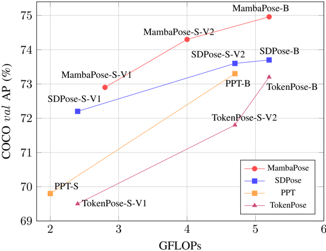
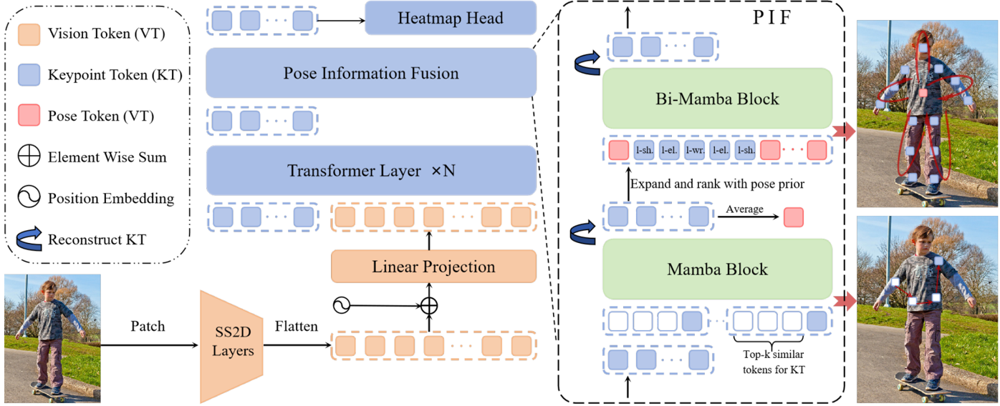

<!-- paperwork:convert-whole-document — source_kind: paper, pagecount: 6, sanctioned via SKILL.md §workflow -->
## MambaPose: Efficient 2D Human Pose Estimation with Pose-Prior Guided State Space Model

Yalong Xu 1 , Mengting Jiang 1 , Yang Gao 1 , Junlong Mu 1 , Di Wang 2 , Lin Zhao 1*

1 PCA Lab, Nanjing University of Science and Technology

2 Xidian University

{ yalongxu, jmetin, gaoyang2001, junlongmu, linzhao } @njust.edu.cn { wangdi } @xidian.edu.cn

Abstract -Transformer-based methods have achieved remarkable accuracy in 2D human pose estimation (HPE), exemplified by ViTPose. However, their high computational cost remains a critical limitation. Recently, Mamba, known for its linear complexity, has demonstrated impressive efficiency across various vision tasks. Despite this, there has been limited exploration of Mamba to 2D HPE. We find that incorporating pose priors can notably enhance the modeling capacity of Mamba. Therefore, we propose MambaPose, an efficient and accurate method that introduces a Mamba-based Pose Information Fusion (PIF) module. Specifically, PIF integrates global information by leveraging semantic similarity between tokens, followed by bidirectional cyclic scanning that incorporates pose structural priors to capture geometry-aware local details. Our method achieves 75.0 AP on the COCO validation set at 5.2 GFLOPs, establishing a new benchmark under limited computational resources. Code is available at https://github.com/Aritoria/MambaPose.

Index Terms -Human pose estimation, SSM, Mamba, Efficiency

## I. INTRODUCTION

Human pose estimation (HPE) aims to predict the location of body keypoints from an image. In recent years, Transformer-based methods, such as Swin [1] and ViTPose [2], have achieved remarkable accuracy. These methods surpass earlier CNN-based approaches [3], [4], particularly in modeling long-range dependencies. Swin leverages a sliding window mechanism for hierarchical attention across the image, while ViTPose directly models global information by leveraging the strong fitting capacity of Transformer. Notably, ViTPose-L achieves an impressive 78.2 AP on the COCO dataset.

Nevertheless, the high accuracy achieved by Transformerbased methods comes at a substantial computational cost, primarily due to their quadratic complexity [5]. For instance, Swin-L delivers a +2.6 AP improvement over ResNet50 [3], but with an 8-fold increase in computational overhead (41 compared to 5 GFLOPs). Therefore, some approaches aim to reduce the computational cost while preserving accuracy, such as TokenPose [6] and SDPose [7]. Despite these advancements, existing small scale methods are still constrained by limited model capacity. Additionally, due to applying uniform attention across all positions [5], these models often fail to fully leverage pose prior information, leaving significant room for further improvements in accuracy.

*Corresponding author.

Fig. 1. Comparsions between other Transformer-based models and our MambaPose on COCO val set. Our approach achieves a performance breakthrough with the same level of computational resources, as shown by the red line.

Recently, Mamba [8] shows impressive capabilities in longrange modeling with linear time complexity and has attained remarkable success across a variety of vision tasks [9], including classification, segmentation, and other downstream applications. However, its application to 2D human pose estimation remains relatively unexplored. The general vision Mamba model processes the entire 2D image without any specialized design tailored for human pose estimation, limiting the full potential of Mamba. Therefore, the core problem of using Mamba for pose estimation lies in developing a scanning strategy that effectively incorporates pose structure priors.

In this paper, we introduce MambaPose, an efficient and accurate method for 2D HPE. The core of our method is the Pose Information Fusion (PIF) module, which integrates pose priors into the Mamba framework, enabling the fusion of pose information from both global and local perspectives. Specifically, we dynamically determine the Mamba scanning path based on semantic similarity to facilitate global information fusion. Additionally, guided by geometric priors of pose structure, we employ bidirectional cyclic scanning to ensure continuity in the fusion of local information.

Experimental results on the COCO [10] benchmark and CrowdPose [11] validate the effectiveness of our method. As shown in Figure 1, MambaPose-B achieves a +1.3 performance improvement on COCO over the state-of-the-art SDPose-B under the same computational cost. Additionally, on CrowdPose, MambaPose-S-V1 achieves 65.6 ( ↑ 1.1) AP with only 2.8 GFLOPs ( ↓ 40%), compared to SDPose-S-V2.

In summary, the main contributions of our work are:

- To the best of our knowledge, we are the first to uncover the importance of pose priors for the Mamba framework in 2D Human Pose Estimation.
- We propose an efficient and accurate MambaPose that employs an innovative scanning strategy driven by pose priors.
- Experiments demonstrate that our method achieves a significant performance breakthrough under limited computational resources.

## II. RELATED WORK

## A. Human pose estimation

In recent years, human pose estimation (HPE) makes significant progress in accuracy [12]-[14]. Early approaches rely primarily on convolutions. SimpleBaseline [3] uses a straightforward residual network to achieve strong performance. Subsequently, HRNet [4] improves performance by preserving high-resolution features through a deep neural network. With the rise of attention mechanisms, Transformerbased architectures are proved more effective in capturing long-range dependencies. TransPose [15] combines CNNs with Transformers by applying attention directly to the features extracted from the CNN-based model. VitPose [2], on the other hand, processes the image into tokens and uses pure attention mechanisms, achieving state-of-the-art performance.

However, due to the substantial computational cost of attention mechanisms with quadratic complexity, some approaches focus on reducing the computational overhead of Transformerbased models. Compared to TransPose, TokenPose [6] minimizes CNN computations and introduces keypoint tokens to better capture pose structure information. PPT [16] further reduces attention calculations by predicting and discarding irrelevant image tokens. Additionally, SHaRPose [17] allocates computational resources to different regions based on their importance. Recently, SDPose [7] achieves better results with fewer computations by incorporating self-circular distillation into TokenPose. Despite these advancements, these methods still face a significant accuracy gap compared to larger models. Therefore, enhancing the predictive capabilities of smaller neural networks remains a critical challenge.

## B. Mamba architecture

Comparing to Transformer-based methods, Mamba [8] has demonstrated remarkable capabilities in modeling long-range dependencies with linear time complexity. In basic visual tasks such as classification, Vim [9] transforms the image into visual tokens and flattens them, subsequently utilizing a bidirectional scanning to capture global visual context, where each visual token receives information from only two directions (either up/down or left/right). Vmamba [18] enhances this by incorporating geometric positional information and optimizing bidirectional scanning into a four-directional scan (up, down, left, right). Mamba has also been successfully applied to other downstream tasks [19]-[21].

Human pose estimation differs from other visual tasks due to the rich pose priors, particularly the geometric constrains of human structure. In 3D HPE, Pose Magic [22] combines Mamba with GCN [23] to better capture relationships between keypoints. Further advancements are made with PoseMamba [24], which acknowledges the importance of the scanning order for keypoints, but still fails to fully ensure the continuity of geometric positions during scanning. Despite these advances, the optimal application of Mamba in the context of 2D HPE remains relatively unexplored.

## III. METHOD

## A. Preliminaries

Mamba State Space Models (SSM) [25], [26] can be viewed as a linear time-invariant (LTI) system used to process continuous signals. This system maps a 1D sequence x ( t ) ∈ R C to an output y ( t ) ∈ R C through an implicit latent state h ( t ) ∈ R N , which contains all information from previous time steps. This relationship is typically described by the following system of ordinary differential equations (ODEs):

<!-- formula-not-decoded -->

where A , B , and C are weighting parameters.

To handle discrete sequence inputs, continuous-time SSMs must be discretized. The discretization can be represented as:

<!-- formula-not-decoded -->

where ∆ represents the step size and I is the identity matrix. The weights in this discrete system are fixed, allowing for efficient computation using recursive or convolutional methods, with a computational complexity that grows linearly with sequence length.

However, the selective state space model (Mamba) points out a limitation in this LTI system: it lacks content-based reasoning capability. This is because the matrices in SSM do not change with the input. To address this, Mamba introduces time-varying parameters:

<!-- formula-not-decoded -->

where Linear d is a parameterized projection layer that maps the input to dimension d , and the softplus is an activation function.

Mamba in Vision The application of Mamba in computer vision is similar to that of Transformer. For an input visual feature X ∈ R H × W × C , it is typically transformed into tokens { v 1 , v 2 , . . . , v K } , which can be expressed as:

<!-- formula-not-decoded -->

where K = H h × W w , and h and w are the patch sizes.

Mamba is then used to capture the relationships among the tokens. However, unlike text sequences, the direction of information in 2D information can come from any direction. Therefore, it is inefficient to simply combine forward and backward scanning. Tokens require a carefully designed scanning sequence to maximize model performance.Typically, this process involves four steps as:

Fig. 2. The architecture of MambaPose. We design a Pose Information Fusion (PIF) module that incorporates pose priors. The PIF module first performs global information fusion for each token based on semantic similarity. Then, it employs a bidirectional cyclic scanning path guided by human pose structural priors to achieve local information fusion.

<!-- formula-not-decoded -->

where Ed denotes the expansion of the original sequence, Arr represents the manually defined scanning order, and Reconstruct refers to restoring the tokens to their original shape and order.

## B. Overall structure

We propose MambaPose to alleviate the conflict between computational cost and accuracy in 2D Human Pose Estimation. The architecture is shown in Figure 2. We design a Pose Information Fusion (PIF) module that integrates Mamba to explore the relationships between the keypoints using a novel scanning technique guided by prior pose structure knowledge.

Formally, given a 2D image I ∈ R H × W × 3 , the objective is to predict the 2D keypoint locations K 2 d ∈ R J × 2 , where J denotes the number of keypoints. First, we utilize the Mambabased SS2D [18] module to construct a lightweight backbone for feature extraction, represented as:

<!-- formula-not-decoded -->

where V c = { v 0 c , v 1 c , . . . , v H 32 × W 32 c } represents the flattened visual features and i indicates the layer index. The model size is controlled by the number of SS2D blocks L i in each layer.

Next, tokens P c = { p 1 c , p 2 c , . . . , p J c } are introduced to represent the keypoints, which are then interacted with the visual tokens through Transforme layers:

<!-- formula-not-decoded -->

Subsequently, the Mamba-based Pose Information Fusion (PIF) module is employed to further explore the relationships between the keypoint tokens P = { p 0 , p 1 , . . . , p J } using pose prior information:

<!-- formula-not-decoded -->

where Prior refers to the scanning order derived from the geometric pose structure. Finally, P ′ is passed through a heatmap head and decoded to obtain the predicted keypoint locations K 2 d ∈ R J × 2 .

## C. Pose Information Fusion

In this section, we introduce the Pose Information Fusion module. It integrates information from both global and local perspectives, while incorporating pose priors. Specifically, before inputting P = { p 0 , p 1 , . . . , p J } into each Mamba Block, we first expand and rearrange the token sequence to modify the scanning order. After processing, the sequence is reconstructed to match the original order of P .

Formally, we initiate global token interaction to gather information from semantically similar positions. For each token p i ∈ P = { p 0 , p 1 , . . . , p J } , we select the top k most similar tokens and concatenate them with p i as:

<!-- formula-not-decoded -->

where the order of S i reflects the scanning sequence for the token p i , as visually represented in Figure 2. Each S i is then processed by Mamba for global information fusion:

<!-- formula-not-decoded -->

where J denotes the number of keypoints. We reconstruct P G by selecting keypoint tokens from S G in the order of keypoint types in P .

For local information fusion, we employ a bidirectional cyclic scanning strategy, guided by pose structure priors.

TABLE I COMPARISON WITH THE STATE-OF-THE-ARTS METHODS ON COCO val SET.

| Method                    | AP 50          |   AP 75 | AP M                     | AP L                     | AR                       | GFLOPs                  | AP                                 |
|---------------------------|----------------|---------|--------------------------|--------------------------|--------------------------|-------------------------|------------------------------------|
| SimpleBaseline-Res50 [3]  | 88.6 87.7 87.7 |    78.3 | 67.1 65.7 66.1 68.8 69.4 | 77.2 76.6 76.7 79.1 79.2 | 76.3 74.9 75.1 77.7 78.2 | 8.9 2.4 2.0 2.4 2.8 4.7 | 70.4 69.5 69.8 †72.3 †72.8( ↑ 0.5) |
| TokenPose-S-V1* [6]       |                |    77.1 |                          |                          |                          |                         |                                    |
| PPT-S* [16]               |                |    76.8 |                          |                          |                          |                         |                                    |
| SDPose-S-V1* [7]          | 89.2           |    79.6 |                          |                          |                          |                         |                                    |
| MambaPose-S-V1(ours)      | 89.7           |    80.5 |                          |                          |                          |                         |                                    |
| TokenPose-S-V2* [6]       | 88.7           |    79.0 | 68.3                     | 78.5                     | 77.0                     |                         | 71.8                               |
| PPT-B* [16]               | 89.5           |    80.8 | 70.3                     | 79.8                     | 78.8                     | 4.7                     | 73.4                               |
| SDPose-S-V2* [7]          | 89.5           |    80.4 | 70.1                     | 80.3                     | 78.7                     | 4.7                     | ‡73.5                              |
| MambaPose-S-V2(ours)      | 90.5           |    82.0 | 70.9                     | 80.6                     | 79.6                     | 4.0                     | ‡74.2( ↑ 0.7)                      |
| SimpleBaseline-Res101 [3] | 89.3           |    79.3 | 68.1                     | 78.1                     | 77.1                     | 12.4                    | 71.4                               |
| DistilPose-L [27]         | 89.9           |    81.4 | 71.0                     | 81.8                     | 79.8                     | 10.3                    | 74.4                               |
| ViTPose-S [2]             | 90.3           |    81.3 | 67.1                     | 75.8                     | 79.1                     | 5.7                     | 73.8                               |
| TokenPose-B* [6]          | 89.5           |    80.2 | 70.1                     | 79.8                     | 78.7                     | 5.2                     | 73.2                               |
| SDPose-B* [7]             | 89.6           |    80.4 | 70.3                     | 80.5                     | 79.1                     | 5.2                     | §73.7                              |
| MambaPose-B(ours)         | 90.5           |    82.7 | 71.3                     | 81.5                     | 80.1                     | 5.2                     | §75.0( ↑ 1.3)                      |

For fair comparison, all experiments are executed on MMpose. The resolution is set to 256x192. * indicates results from SDPose [7]. †, ‡ and § represent the data pair used for comparison.

Specifically, by averaging P G , we obtain a pose token p m to represent the body center and then arrange tokens into five subsequences: head ( S head ), left arm ( S l -arm ), left leg ( S l -leg ), right leg ( S r -leg ), and right arm ( S r -arm ). We cyclically scan each region by starting and ending as p m . For example, the S l -arm is:

<!-- formula-not-decoded -->

We then concatenate the scanning sequences for all five regions as:

<!-- formula-not-decoded -->

where S represents the scanning sequence for the entire body. Notably, S remains continuous both locally and globally. Locally, each subsequence performs a cyclic scan of geometrically adjacent positions, while globally, continuity is ensured by p m .

Next, we apply bidirectional Mamba to the constructed scanning sequence S :

<!-- formula-not-decoded -->

where Mamba fwd and Mamba bwd represent the forward and backward modeling, respectively, with a normalization layer applied. Finally, we reconstruct P L = { p 0 , p 1 , . . . , p J } from S ′ by by selecting the token closest to the center of S ′ from each keypoint category. This process is visually explained in Figure 2.

## IV. EXPERIMENT

## A. Experiment setup

Datasets We conduct experiments on the MSCOCO [10] and CrowdPose [11] datasets. MSCOCO 2017 contains 200k images and 250k pose samples annotated with 17 keypoints and includes three subsets: train , val , and test -dev . We train the model on the train set and report results on the val and test -dev sets. Additionally, we also evaluate our methods on the more challenging CrowdPose dataset, which includes approximately 20k images and 80k occluded human poses, annotated with 14 keypoints.

TABLE II ARCHITECTURE CONFIGURATIONS

| Model          | SS2D Num   |   Out Channel |   GFLOPs |
|----------------|------------|---------------|----------|
| MambaPose-S-V1 | [1,1,2,1]  |           768 |      2.8 |
| MambaPose-S-V2 | [1,2,3,2]  |           768 |      4.0 |
| MambaPose-B    | [2,2,5,2]  |           768 |      5.2 |

Evaluation Metrics For evaluation, we use bounding boxes consistent with previous works [6], [28]. The standard Average Precision (AP) is employed as the evaluation metric on the MSCOCO and CrowdPose, calculated based on Object Keypoint Similarity (OKS) [29].

Implementation and Training Details We design models on three scales to meet varying computational requirements. Specifically, we adjust the model's computational cost by controlling the number of SS2D modules L i of each layer in the backbone, with specific configurations detailed in Table II. The number of Transformer layers N is set to 6 by default. To ensure fair comparison, all experiments are conducted on MMpose [30]. The default data pipelines in MMpose are utilized, with only flipping operations applied during test. Additionally, the pre-trained Vmamba-T [18] model on ImageNet [31] is used. The model is trained for 300 epochs with a learning rate of 1 × 10 -3 , which is reduced to 1 × 10 -4 and 1 × 10 -5 at the 200th and 260th epochs, respectively.

## B. Results

**1) Comparison to state-of-the-art methods on COCO :**

We compare the computational cost and accuracy of our proposed MambaPose with classic and state-of-the-art (SOTA) Transformer-based methods. Specifically, we compare our method with the small versions of classic models, such as By default, the resolution is set to 256x192. * indicates results from SDPose [7]. † and ‡ represent the data pair used for comparison.

TABLE III COMPARISON WITH THE STATE-OF-THE-ART ON COCO test -dev SET.

| Method               | AP M      | AP L      | GFLOPs          | AP              |
|----------------------|-----------|-----------|-----------------|-----------------|
| TokenPose-S-V1* [6]  | 65.1 65.8 | 74.5 75.2 | 2.4 2.0 2.4 2.8 | 68.6 69.2 †71.7 |
| PPT-S* [16]          |           |           |                 |                 |
| SDPose-S-V1* [7]     | 68.3      | 77.5      |                 |                 |
| MambaPose-S-V1(ours) | 69.5      | 77.7      |                 | †72.4( ↑ 0.7)   |
| PRTR-Res101* [32]    | 67.3      | 79.7      | 33.4            | 72.0            |
| RLE-Res50* [14]      | 67.2      | 74.3      | 4.0             | 69.8            |
| TokenPose-S-V2* [6]  | 67.7      | 77.1      | 4.7             | 71.1            |
| SDPose-S-V2* [7]     | 69.3      | 78.5      | 4.7             | ‡72.7           |
| MambaPose-S-V2(ours) | 70.5      | 78.8      | 4.0             | ‡73.5( ↑ 0.8)   |

TABLE IV COMPARISON WITH THE STATE-OF-THE-ART ON CROWDPOSE.

| Method                   |   AR |   GFLOPs | AP            |
|--------------------------|------|----------|---------------|
| PPT-S [16]               | 65.2 |      2.0 | 55.6          |
| SDPose-S-V1 [7]          | 66.8 |      2.4 | †57.3         |
| MambaPose-S-V1(ours)     | 75.2 |      2.8 | †65.6( ↑ 8.3) |
| SimpleBaseline-Res50 [3] | 73.2 |      8.9 | 63.7          |
| RLE-Res50 [14]           | 66.9 |      4.0 | 57.0          |
| SDPose-S-V2 [7]          | 73.7 |      4.7 | ‡64.5         |
| MambaPose-S-V2(ours)     | 77.0 |      4.0 | ‡67.0( ↑ 2.5) |

The resolution is set to 256x192. † and ‡ represent the data pair used for comparison.

ViTPose-S. Furthermore, we compare it with lightweight models, including TokenPose, PPT, and the latest SOTA approach, SDPose, which utilizes distillation.

COCO val set To validate the effectiveness of MambaPose, we conduct experiments on the COCO val set. As shown in Table I, MambaPose-S-V1 achieves an AP of 72.8, outperforming SDPose-S-V1 by +0.5. Additionally, MambaPose-SV2 attains an AP of 74.2, improving by +0.7 over SDPose-SV2 (73.5). Furthermore, MambaPose-B achieves the highest AP of 75.0, surpassing SDPose-B (73.7) by +1.3, while maintaining a similar computational cost of 5.2 GFLOPs. Despite the use of distillation methods with additional supervisory signals, such as SDPose and DistilPose, our method still delivers performance breakthroughs while maintaining computational efficiency.

COCO test -dev set To further validate the effectiveness of our model, we conduct an evaluation on the COCO test -dev set, as shown in Table III. Our method achieves performance breakthroughs across different computational scales. Specifically, MambaPose-S-V1 shows significant improvements over the classic TokenPose-S and PPT-S models. More importantly, when compared to the latest SOTA method, SDPose-S-V1, we achieve a +0.7 AP improvement. Similarly, for the larger model, MambaPose-S-V2, we achieve a +0.8 boost in AP performance.

2) Comparison to state-of-the-art methods on CrowdPose : We conduct experiments on the more challenging CrowdPose dataset, demonstrating a significant performance im- provement with limited computational resources, as shown in Table IV. Specifically, we compare our method with the classic SimpleBaseline-Res50, PPT, and the SOTA method SDPose. The results indicate that MambaPose-S-V1 achieves an AP of 65.6 with only 2.8 GFLOPs, surpassing SDPose-S-V1 by +8.3. Even compared to SDPose-S-V2, MambaPose-S-V1 delivers a +1.1 improvement in AP while reducing computational cost by 1.9 GFLOPs. Additionally, MambaPose-S-V2 achieves stateof-the-art performance with an AP of 67.0.

TABLE V THE EFFECTIVENESS OF PIF MODULE ON COCO AND CROWDPOSE.

| Method         | Dataset   | w/ PIF   |   GFLOPs |   AP |
|----------------|-----------|----------|----------|------|
| MambaPose-S-V1 | COCO      | ×        |      2.7 | 72.6 |
| MambaPose-S-V1 | COCO      | ✓        |      2.8 | 72.8 |
| MambaPose-S-V1 | CrowdPose | ×        |      5.1 | 65.3 |
| MambaPose-S-V1 | CrowdPose | ✓        |      5.2 | 65.6 |

TABLE VI COMPARISON OF DIFFERENT SCANNING STRATEGIES.

| Method                                       | Prior   | Cycling   | AP                |
|----------------------------------------------|---------|-----------|-------------------|
| MambaPose-S-V1 MambaPose-S-V1 MambaPose-S-V1 | ✓ ✓     | ✓ ✓       | 65.64 65.35 65.49 |

## C. Ablation Study

Effectiveness of the Pose Information Fusion module To evaluate the effectiveness of Pose Information Fusion (PIF), we conducted experiments on both the COCO and CrowdPose datasets. Specifically, for models without the PIF module, keypoint tokens are directly mapped to heatmaps after passing through the Transformer layers. As shown in Table V, the model with the PIF module, requiring only +0.1 GFLOPs, achieved improvements of +0.2 AP on COCO and +0.3 AP on CrowdPose. These results underscore that the PIF module plays a pivotal role in enhancing performance by integrating pose priors.

Effectiveness of our scanning strategy To validate the effectiveness of the bidirectional cyclic scanning designed based on pose priors, we conducted comparative experiments on the CrowdPose dataset using different scanning approaches. Specifically, we test two alternative strategies: one that disregards pose structure priors and another that eliminates the cycling of each subsequences. As shown in Table VI, removing pose priors results in the most significant performance drop, from 65.6 to 65.3 AP. Additionally, removing the cyclic strategy disrupts the geometric continuity, leading to a loss of 0.15 AP. These results validate the rationality of the scanning strategy we designed.

## V. CONCLUSION

We thoroughly study the usage of Mamba to alleviate the conflict between accuracy and computational cost in human pose estimation. We find that, under limited computational resources, incorporating pose priors into the scanning strategy enhances the fitting capacity of Mamba-based models. Therefore, we propose an accurate and efficient MambaPose, with a novel Pose Information Fusion module. Specifically, each token gathers information from semantically relevant regions for global feature fusion, followed by bidirectional cyclic scanning guided by pose priors to fuse geometrically adjacent local information. Experiments demonstrate that our method significantly boosts performance under computational constraints.

## VI. ACKNOWLEDGMENTS

This work was supported by the National Science Fund of China under Grant 62172222 and the National Key Research and Development Program of China (International Collaboration Special Project, No.SQ2023YFE0102775).

**REFERENCES**

- [1] Ze Liu, Yutong Lin, Yue Cao, Han Hu, Yixuan Wei, Zheng Zhang, Stephen Lin, and Baining Guo, 'Swin transformer: Hierarchical vision transformer using shifted windows,' in Proceedings of the IEEE/CVF international conference on computer vision , 2021, pp. 10012-10022.
- [2] Yufei Xu, Jing Zhang, Qiming Zhang, and Dacheng Tao, 'Vitpose: Simple vision transformer baselines for human pose estimation,' Advances in Neural Information Processing Systems , vol. 35, pp. 38571-38584, 2022.
- [3] Bin Xiao, Haiping Wu, and Yichen Wei, 'Simple baselines for human pose estimation and tracking,' in Proceedings of the European conference on computer vision (ECCV) , 2018, pp. 466-481.
- [4] Ke Sun, Bin Xiao, Dong Liu, and Jingdong Wang, 'Deep high-resolution representation learning for human pose estimation,' in Proceedings of the IEEE/CVF conference on computer vision and pattern recognition , 2019, pp. 5693-5703.
- [5] Ashish Vaswani, Noam Shazeer, Niki Parmar, Jakob Uszkoreit, Llion Jones, Aidan N. Gomez, Lukasz Kaiser, and Illia Polosukhin, 'Attention is all you need,' 2017.
- [6] Yanjie Li, Shoukui Zhang, Zhicheng Wang, Sen Yang, Wankou Yang, Shu-Tao Xia, and Erjin Zhou, 'Tokenpose: Learning keypoint tokens for human pose estimation,' in Proceedings of the IEEE/CVF International conference on computer vision , 2021, pp. 11313-11322.
- [7] Sichen Chen, Yingyi Zhang, Siming Huang, Ran Yi, Ke Fan, Ruixin Zhang, Peixian Chen, Jun Wang, Shouhong Ding, and Lizhuang Ma, 'Sdpose: Tokenized pose estimation via circulation-guide selfdistillation,' in Proceedings of the IEEE/CVF Conference on Computer Vision and Pattern Recognition , 2024, pp. 1082-1090.
- [8] Albert Gu and Tri Dao, 'Mamba: Linear-time sequence modeling with selective state spaces,' arXiv preprint arXiv:2312.00752 , 2023.
- [9] Lianghui Zhu, Bencheng Liao, Qian Zhang, Xinlong Wang, Wenyu Liu, and Xinggang Wang, 'Vision mamba: Efficient visual representation learning with bidirectional state space model,' arXiv preprint arXiv:2401.09417 , 2024.
- [10] Tsung-Yi Lin, Michael Maire, Serge Belongie, James Hays, Pietro Perona, Deva Ramanan, Piotr Doll´ ar, and C Lawrence Zitnick, 'Microsoft coco: Common objects in context,' in Computer Vision-ECCV 2014: 13th European Conference, Zurich, Switzerland, September 6-12, 2014, Proceedings, Part V 13 . Springer, 2014, pp. 740-755.
- [11] Jiefeng Li, Can Wang, Hao Zhu, Yihuan Mao, Hao-Shu Fang, and Cewu Lu, 'Crowdpose: Efficient crowded scenes pose estimation and a new benchmark,' in Proceedings of the IEEE/CVF conference on computer vision and pattern recognition , 2019, pp. 10863-10872.
- [12] Yuhui Yuan, Rao Fu, Lang Huang, Weihong Lin, Chao Zhang, Xilin Chen, and Jingdong Wang, 'Hrformer: High-resolution vision transformer for dense predict,' Advances in neural information processing systems , vol. 34, pp. 7281-7293, 2021.
- [13] Tao Jiang, Peng Lu, Li Zhang, Ningsheng Ma, Rui Han, Chengqi Lyu, Yining Li, and Kai Chen, 'Rtmpose: Real-time multi-person pose estimation based on mmpose,' arXiv preprint arXiv:2303.07399 , 2023.
- [14] Jiefeng Li, Siyuan Bian, Ailing Zeng, Can Wang, Bo Pang, Wentao Liu, and Cewu Lu, 'Human pose regression with residual log-likelihood estimation,' in Proceedings of the IEEE/CVF international conference on computer vision , 2021, pp. 11025-11034.
- [15] Sen Yang, Zhibin Quan, Mu Nie, and Wankou Yang, 'Transpose: Towards explainable human pose estimation by transformer,' arXiv preprint arXiv:2012.14214 , vol. 2, no. 6, 2020.
- [16] Haoyu Ma, Zhe Wang, Yifei Chen, Deying Kong, Liangjian Chen, Xingwei Liu, Xiangyi Yan, Hao Tang, and Xiaohui Xie, 'Ppt: tokenpruned pose transformer for monocular and multi-view human pose estimation,' in European Conference on Computer Vision . Springer, 2022, pp. 424-442.
- [17] Xiaoqi An, Lin Zhao, Chen Gong, Nannan Wang, Di Wang, and Jian Yang, 'Sharpose: Sparse high-resolution representation for human pose estimation,' in Proceedings of the AAAI Conference on Artificial Intelligence , 2024, vol. 38, pp. 691-699.
- [18] Yue Liu, Yunjie Tian, Yuzhong Zhao, Hongtian Yu, Lingxi Xie, Yaowei Wang, Qixiang Ye, and Yunfan Liu, 'Vmamba: Visual state space model,' arXiv preprint arXiv:2401.10166 , 2024.
- [19] Haoye Dong, Aviral Chharia, Wenbo Gou, Francisco Vicente Carrasco, and Fernando De la Torre, 'Hamba: Single-view 3d hand reconstruction with graph-guided bi-scanning mamba,' arXiv preprint arXiv:2407.09646 , 2024.
- [20] Hongqiu Wang, Yixian Chen, Wu Chen, Huihui Xu, Haoyu Zhao, Bin Sheng, Huazhu Fu, Guang Yang, and Lei Zhu, 'Serp-mamba: Advancing high-resolution retinal vessel segmentation with selective state-space model,' arXiv preprint arXiv:2409.04356 , 2024.
- [21] Lulin Li, Ben Chen, Xuechao Zou, Junliang Xing, and Pin Tao, 'Uvmamba: A dcn-enhanced state space model for urban village boundary identification in high-resolution remote sensing images,' arXiv preprint arXiv:2409.03431 , 2024.
- [22] Xinyi Zhang, Qiqi Bao, Qinpeng Cui, Wenming Yang, and Qingmin Liao, 'Pose magic: Efficient and temporally consistent human pose estimation with a hybrid mamba-gcn network,' arXiv preprint arXiv:2408.02922 , 2024.
- [23] Thomas N Kipf and Max Welling, 'Semi-supervised classification with graph convolutional networks,' arXiv preprint arXiv:1609.02907 , 2016.
- [24] Yunlong Huang, Junshuo Liu, Ke Xian, and Robert Caiming Qiu, 'Posemamba: Monocular 3d human pose estimation with bidirectional global-local spatio-temporal state space model,' arXiv preprint arXiv:2408.03540 , 2024.
- [25] Harsh Mehta, Ankit Gupta, Ashok Cutkosky, and Behnam Neyshabur, 'Long range language modeling via gated state spaces,' arXiv preprint arXiv:2206.13947 , 2022.
- [26] Jue Wang, Wentao Zhu, Pichao Wang, Xiang Yu, Linda Liu, Mohamed Omar, and Raffay Hamid, 'Selective structured state-spaces for longform video understanding,' in Proceedings of the IEEE/CVF Conference on Computer Vision and Pattern Recognition , 2023, pp. 6387-6397.
- [27] Suhang Ye, Yingyi Zhang, Jie Hu, Liujuan Cao, Shengchuan Zhang, Lei Shen, Jun Wang, Shouhong Ding, and Rongrong Ji, 'Distilpose: Tokenized pose regression with heatmap distillation,' in Proceedings of the IEEE/CVF Conference on Computer Vision and Pattern Recognition , 2023, pp. 2163-2172.
- [28] Jonathan J Tompson, Arjun Jain, Yann LeCun, and Christoph Bregler, 'Joint training of a convolutional network and a graphical model for human pose estimation,' Advances in neural information processing systems , vol. 27, 2014.
- [29] Matteo Ruggero Ronchi and Pietro Perona, 'Benchmarking and error diagnosis in multi-instance pose estimation,' in Proceedings of the IEEE international conference on computer vision , 2017, pp. 369-378.
- [30] MMPose Contributors, 'Openmmlab pose estimation toolbox and benchmark,' 2020.
- [31] Jia Deng, Wei Dong, Richard Socher, Li-Jia Li, Kai Li, and Li Fei-Fei, 'Imagenet: A large-scale hierarchical image database,' in 2009 IEEE conference on computer vision and pattern recognition . Ieee, 2009, pp. 248-255.
- [32] Ke Li, Shijie Wang, Xiang Zhang, Yifan Xu, Weijian Xu, and Zhuowen Tu, 'Pose recognition with cascade transformers,' in Proceedings of the IEEE/CVF conference on computer vision and pattern recognition , 2021, pp. 1944-1953.
